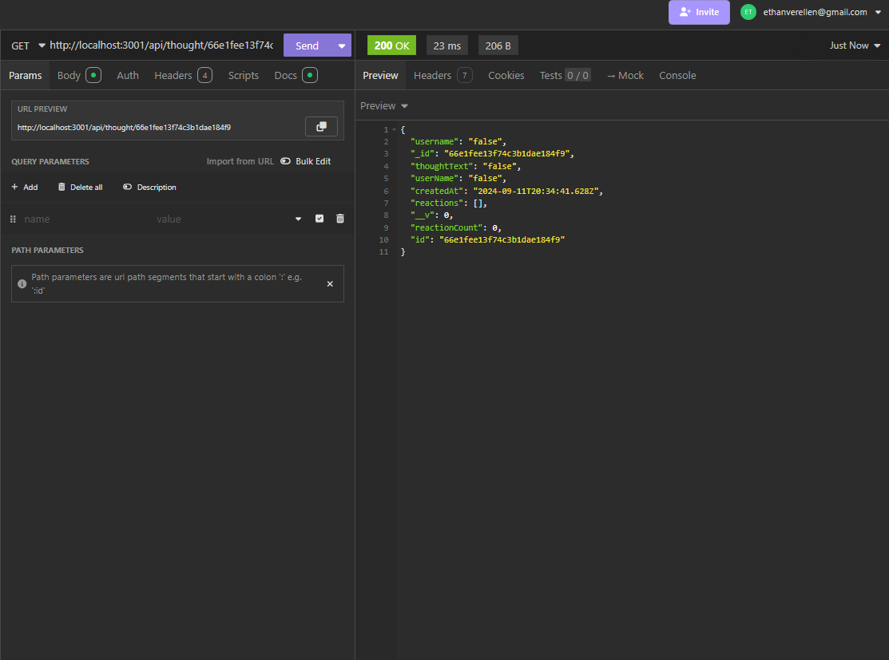
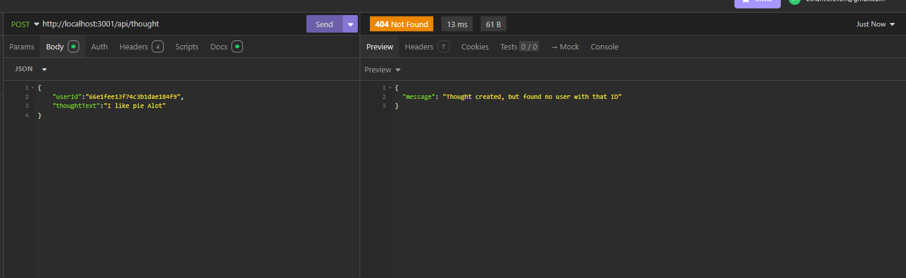
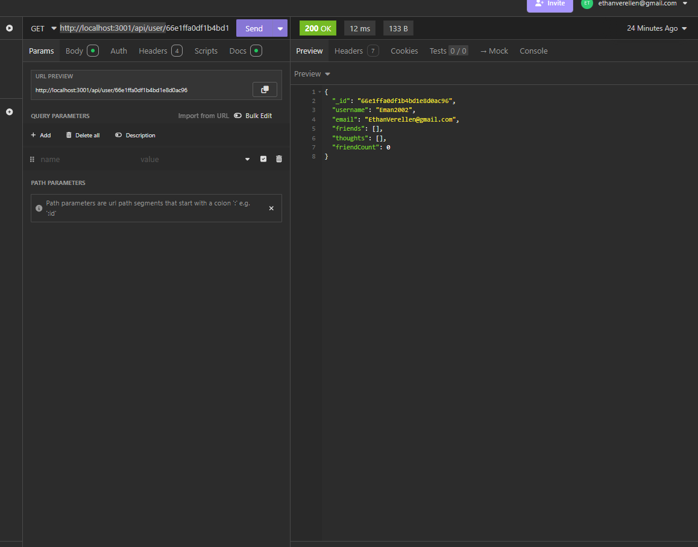

# API-Functionality

by Ethan Verellen

## Table of Contents

[Description](#description)

[Useage](#useage)

[Installation](#installation)

[Images](#images)

[Tests](#tests)

[Contributors](#contributors)

[Links](#links)

[Questions](#questions)

## Description

It is a backend for a blog or other text based program that allows for multiple users.  It primarily focuses on the iteractions of the users and blogs with a database(not sql)

## Useage

In order to use this project, I suggest you find it in a terminal/git and run the line npm i. Then you would want to run npm start dev and go to insomnia and go to http://localhost:3001/api/user or http://localhost:3001/api/thought.

## Installation

To install, Either download as a zip file from the repo, or git clone in gitbash or other equivelences.

## Images

## Tests

Launch it and look for errors

## Contributing

Ethan Verellen

## Links

https://github.com/Ethan-Verellen/Track-Your-Employees

## Questions

https://github.com/Ethan-Verellen

ethanverellen@gmail.com

